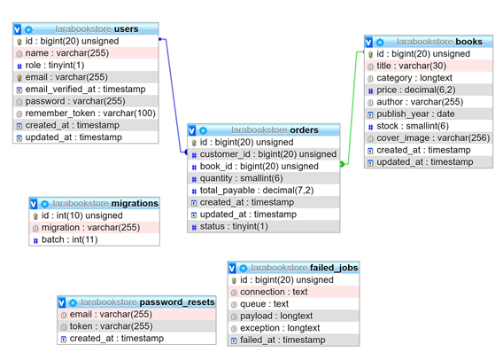

# Aston book store (University Project)
This web application allows all users to view books, registered users to place orders for books and staff to manage books and orders.

- Heroku Website Link: https://larabookstore.herokuapp.com/
- Admin username: astonadmin@aston.com pass: astonadmin
- User username: astonuser@aston.com pass: astonuser

I have used the Laravel framework to create this book store, web application. For styling, I have used CSS and bootstap to keep the website responsive, clean and simple to use. 

## System Functionality:
This book store can be visited by 3 types of users: unregistered, registered and staff users. Using Authentication gates, low cleareance users cannot visit high clearance views. For exmple, an unregistered user will be redirected if they try to access an admin view.

### Unregistered users …
- can register as customer
- can see all books in the system with basic information (title, category, price)
- can do 'show more' details for a book (title, category, price, book cover, available stock and publish year)

### Registered Users…
- Can Log in or out
- can see all books in the system with basic information (title, category, price)
- can do 'show more' details for a book (title, category, price, book cover, available stock and publish year)
- Can check the cart
- Can add books to cart through book list
- Can delete a book from cart
- Can update the quantity of a book in cart
- Can place an order for a book

### Staff users can…
- Log in or out
- Can increase stock quantity of a book
- Can View order and their details
- Can Complete orders

## Other functional features:
- Sensible names for URL (named)
- Simple and neat sytling for webpages
- Adequate error reporting
- good site navigation - Pages have links to related pages and home page 

## Security features
- Authentication is used to divert users to their relevant views, so a public users cannot access
staff views
- Passwords are Hashed on the database
- All inputted requests have been validated and some fields guarded from mass injection
- Restricted file upload to only images with restricted size
- Clever stock system, all input is restricted to prevent inserting a value above stock level
When a book is added to cart while same book already exists in cart, the quantity is
increased, and a repeated listing is not added.
In the cart a user can override the stock level.
- A Mix of query builder and eloquent model methods are used to carry out CRUD functions.
Query builder was used since loading times are more than 50% faster then eloquent
methods
See:
- Controller methods use gates to authenticate the user and direct them to the correct view,
this prevents normal users from accessing admin pages by inputting the URL of the page.
See: (all controller methods that direct to a view use gates)

## Database structure

*Disclaimer*
I understand that a pivot table called (baskets) should have been used to store items in
the cart instead of the orders table(see below), however I learnt this later, and due to
shortness of time I continued to use the orders table to store cart items. To distinguish
between orders and cart items I implemented a status field, when it is 0 that row is an item
of the cart when it is 1 then that item is an order.

- order table (many to many relationship):
- book_id is foreign key and references id in the book table
- customer_id is foreign key and references the id in user id

